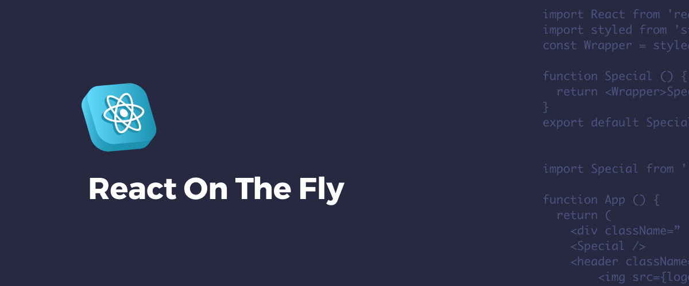
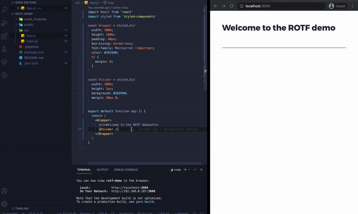

# React On The Fly



## Overview
Create simple React components on the fly. Structure your codebase with placeholders and focus on the overall functionality, rather than leaving the window to copy and paste boilerplate.



## Commands

### From the command pallete

`Create default component, on the fly` - Based on the default template, configure a placeholder component. 

`Create component using your template, on the fly` - Based on the user provided template, configure a placeholder component. The first time this command will be accessed, it will provide all the necessary files for editing the template. 

### From the code editor
`Create and import default component, on the fly` - Will create the default component and import it in the current active file.

`Create and import component using your template, on the fly` - Will create the user defined component and import it in the current active file.


## Default Template
```js
/** ../MyComponent/index.js **/

import React from 'react'
import styled from 'styled-components'
const Wrapper = styled.div``

export default function MyComponent () {
  return <Wrapper>Test</Wrapper>
}
```

## Caveats

* New elements will be anchored as close as possible to the current selected directory. To specify a folder, the user can manually select it in the explorer or leave it up to the active editor window (last selected code tab). As a matter of last resort, they will be prompted to pick a folder they wish to use.

## Future features

- Detection of missing react component and suggestion to create with `rotf`
- Open to feedback 👍